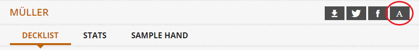
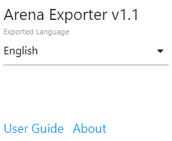
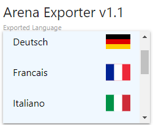

# User Guide

Arena Exporter is a free web extension that allows you to export decklists hosted on the official Wizards of the Coast website for Magic the Gathering: Arena. It's available for both [Chrome](https://chrome.google.com/webstore/detail/arena-exporter/beejdogagnekkjoglfkkocgfilnkhkjc) and [Firefox](https://addons.mozilla.org/en-US/firefox/addon/arena-exporter/).

To get started, click the 'A' icon next to any deck title to copy the list directly to your clipboard, ready for import inside your MTGA client.



For players who are using a non-English client, Arena Exporter also exports to all other languages supported by the MTGA client. Access this menu anytime by clicking the extension's icon inside your browser's extension menu, which is located next to the address bar.  

    

# For Developers

If you do not wish to download the extension from your browser's store, building it for local loading is very straightforward. First, clone the repo and enter the directory. Then, follow these steps to build the resources:
```
npm install
npm run build
```
This process will use webpack to bundle the npm dependencies and source code into a build directory. After this is done, feel free to delete both the src/ and node_modules/ folders.
Once your resources are built, follow the steps for installing an unpacked extension for your particular browser vendor - [Chrome](https://developer.chrome.com/extensions/getstarted#manifest) or [Firefox](https://developer.mozilla.org/en-US/docs/Mozilla/Add-ons/WebExtensions/Temporary_Installation_in_Firefox). 

# About

## Acknowledgements

All instances of the 'A' icon used throughout the extension were created and owned by [Dave Gandy](https://www.flaticon.com/authors/dave-gandy), hosted on [flaticon](https://www.flaticon.com). These assets are licensed under MIT.

The base data used to populate the extension's database was curated by the fine folks at [MTGJSON](https://mtgjson.com).